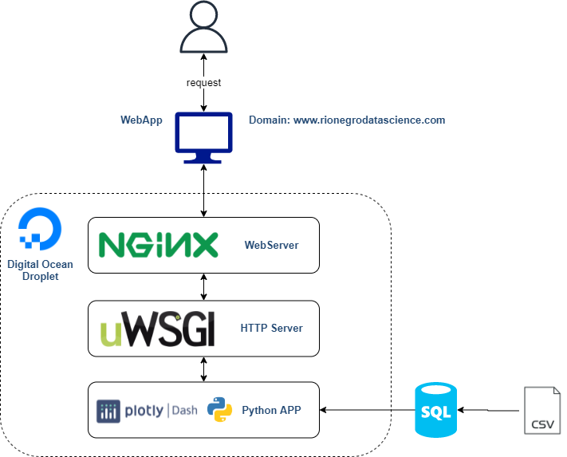
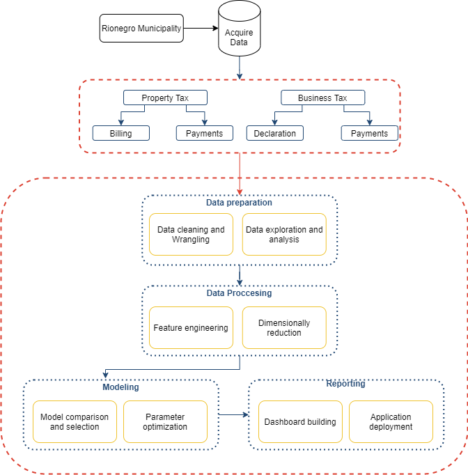
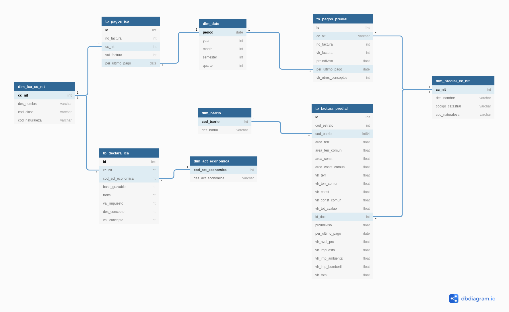

# Backend


[Triibu](www.rionegrodatascience.com "Frontend") is powered by _Digital Ocean_ and _Azure_ services, of which we use the following:

- Frontend deployment:
  - Digital Ocean Droplet with Ubuntu 20.04 distribution
  - 2GB RAM/ 25 GB Disk
  - 2vCPUs

- Azure Database for PostgreSQL

The full stack can be diagramed as this:



## Folder Structure

```
project_root/
│
├── assets/               # Project assets
├── database/             # Tables, dimensions and views DDL scripts
├── ds_notebooks/         # Python and R files with the Data Science Workflow
```
## Data science workflow



### Notebooks index

1. Data cleaning and wrangling
2. Exploratory analysis
3. Carlos' model
4. Jose's model
5. Laura's model

## Database

DDL script for the database scheme creation, tables and materialized views can be found in the [database](../-/tree/master/database) folder. For this project we use _Azure Database for PostgreSQL_. Capacity of the DB instance correspond to a **db.t2.micro** instance (1vCPU, 1 Gb of RAM). 

### Er diagram


